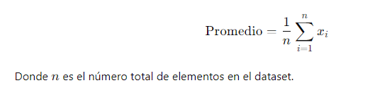
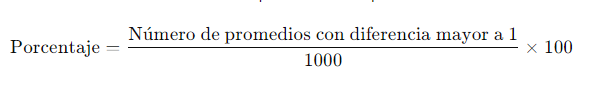
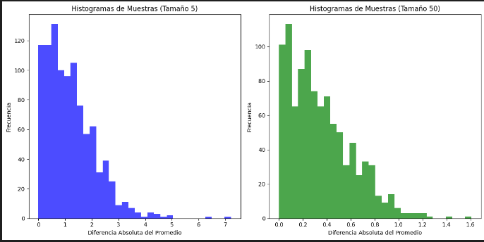

# Algoritmos paralelos y distribuidos: Guia02-Variables aleatorias
## Profesor : Dr. Hans H. Ccacyahuillca Bejar,
## Nombre : Efrain vitorino Marin 
## Codigo: 160337 
# Ejercicio 1: Cálculo del Promedio de los Pesos
- Se solicita calcular el promedio de todos los valores de peso en el dataset. Si `𝑥={𝑥1,𝑥2,…,𝑥𝑛}` representa los pesos de la población, el promedio se calcula mediante la siguiente fórmula:
   
   
   - codigo en python 
   ```python
    import numpy as np
    import pandas as pd
    # Datos de pesos
   pesos = [
    27.03, 24.8, 27.02, 28.07, 23.55, 22.72, 24.82, 21.6, 23.98, 26.6,
    19.24, 21.43, 22.73, 20.1, 20.6, 21.49, 24.73, 27.92, 27.51, 19.88,
    20.72, 24, 25.08, 25.27, 22.08, 20.52, 23.39, 19.87, 17.95, 31.83,
    21.71, 29.99, 20.89, 29.6, 22.77, 26.03, 36.84, 26.25, 22.93, 28.25,
    23.84, 20.53, 24.1, 24.79, 23.68, 21.86, 27.25, 21.55, 24.12, 23.07,
    20.43, 24.82, 25.43, 22.12, 20.99, 23.28, 25.78, 22, 20.74, 21.51,
    26.85, 25.54, 22.51, 21.92, 21.32, 23.59, 26.14, 20.27, 29.6, 24.77,
    22.36, 21.65, 22.08, 26.59, 24.6, 22.19, 29.19, 25.14, 23.19, 27.36,
    23.53, 23.54, 18.41, 28.14, 23.34, 20.11, 18.08, 21.03, 24.23, 19.67,
    22.66, 26.66, 20.69, 27.42, 21.91, 16.82, 24.47, 23.96, 23.18, 28.8,
    26.37, 23.61, 26.07, 27.75, 23.7, 23.73, 24.49, 22.87, 29.23, 21.46,
    22.12, 33.47, 24.96, 26.15, 24.89, 19.41, 26.36, 26.47, 23.19, 22.32,
    20.03, 23.51, 21.35, 21.58, 22.27, 23.09, 23.88, 24.04, 27.15, 18.8,
    28.07, 24.46, 25.42, 20.28, 24.06, 15.51, 22.51, 15.94, 19.9, 19.44,
    22.18, 25.97, 25.96, 23.12, 20.98, 24.78, 22.56, 20.36, 16.05, 17.95,
    22.71, 28.22, 21.5, 20.3, 19.96, 19.07, 22.35, 20.54, 30.45, 23.54,
    20.61, 20.18, 20.59, 23.32, 26.35, 22.91, 25.1, 28.46, 21.31, 28.53,
    28.43, 20.81, 27, 24.55, 21.18, 21.77, 23.8, 20.99, 23.11, 24.82,
    22.59, 18.47, 21.1, 25.83, 16.31, 24.79, 26.08, 32.74, 27.26, 31.24,
    33.81, 23.52, 27.73, 28.26, 23.3, 18.83, 27.7, 19.79, 27.2, 25.4,
    26.75, 23.45, 24.77, 23.39, 22.95, 21.84, 28.4, 28.21, 33.36, 29.13,
    24.21, 22.99, 24.68, 24.67, 25.12, 23.95, 25.69, 28.36, 24.96, 27.36,
    26.91, 26.58, 23.39, 20.25, 23.22]

    # Calcular el promedio
   promedio_total = np.mean(pesos)
   # Mostrar el promedio
   print(f"El promedio total de los pesos es: {promedio_total}")

   ```
   - Resultado 
   ``23.89337777777778``
   # 2: Diferencia entre el Promedio de la Muestra y el Promedio de la Población 

- Se establece la semilla aleatoria en 1 (random.seed(1)).
Se toma una muestra aleatoria de 5 elementos del dataset.
Se calcula el promedio de esta muestra y luego la diferencia absoluta entre este promedio y el promedio de la población completa:
``Diferencia=∣Promedio Muestra−Promedio Poblacion∣Diferencia=∣Promedio Muestra−Promedio Poblacion∣``
- codigo python 
  ```python 
   np.random.seed(1)
   muestra_1 = np.random.choice(pesos, size=5, replace=False)
   promedio_muestra_1 = np.mean(muestra_1)
   diferencia_1 = abs(promedio_muestra_1 - promedio_total)
  diferencia_1
  ```
  - Resultado `` 0.528622222222225``
# Ejercicio 3: Diferencia entre el Promedio de la Muestra y el Promedio de la Población 
- Siguiendo el mismo proceso que en el ejercicio 2, pero con la semilla establecida en 5 ``(random.seed(5))``, se calcula nuevamente la diferencia entre el promedio de la muestra y el promedio de la población.

Explicación de la diferencia entre los ejercicios 2 y 3:

La opción correcta es:

- Porque el promedio de las muestras es una variable aleatoria.
Al cambiar la semilla, las muestras aleatorias cambian, lo que genera promedios diferentes.
- codigo python 
```python
np.random.seed(5)
muestra_2 = np.random.choice(pesos, size=5, replace=False)
promedio_muestra_2 = np.mean(muestra_2)
diferencia_2 = abs(promedio_muestra_2 - promedio_total)
diferencia_2

```
- Resultado ``1.14662222222222``

# 4: Toma de 1000 Muestras Aleatorias de Tamaño 5
- Se establece la semilla en 1.
Usando un bucle for, se extraen 1000 muestras aleatorias de 5 individuos.
Se calculan los promedios de estas muestras y se determina el porcentaje de promedios que están a más de 1 unidad de distancia del promedio de la población.
- 
- codigo python
 ```python
 np.random.seed(1)
diferencias_muestras = []
for _ in range(1000):
    muestra = np.random.choice(pesos, size=5, replace=False)
    promedio_muestra = np.mean(muestra)
    diferencia = abs(promedio_muestra - promedio_total)
    diferencias_muestras.append(diferencia)

porcentaje_mayor_1kg = np.mean(np.array(diferencias_muestras) > 1) * 100
porcentaje_mayor_1kg
 ```
 - Resulatado `` 52.2 ``
 # 5: Toma de 10,000 Muestras Aleatorias de Tamaño 5
 - En este ejercicio, se repite el procedimiento del ejercicio 4, pero aumentando el número de iteraciones a 10,000. Se compara el porcentaje de promedios que se encuentran a más de 1 unidad del promedio de la población.

Se espera que las respuestas no varíen significativamente, ya que tanto 1000 como 10,000 son tamaños de muestra suficientemente grandes.
- codigo Python 
```python
np.random.seed(1)
diferencias_muestras_10000 = []
for _ in range(10000):
    muestra = np.random.choice(pesos, size=5, replace=False)
    promedio_muestra = np.mean(muestra)
    diferencia = abs(promedio_muestra - promedio_total)
    diferencias_muestras_10000.append(diferencia)

porcentaje_mayor_1kg_10000 = np.mean(np.array(diferencias_muestras_10000) > 1) * 100
porcentaje_mayor_1kg_10000
```
- Resultado ``50.49 ``

# 6: Toma de 1000 Muestras de Tamaño 50
- Este ejercicio repite el proceso de toma de muestras aleatorias, pero ahora con muestras de 50 individuos en lugar de 5. Se espera que el porcentaje de promedios que se encuentren a más de 1 unidad del promedio de la población sea menor que en los ejercicios anteriores, debido a la reducción en la dispersión.
 - Codigo python 
 ```python 
 np.random.seed(1)
diferencias_muestras_50 = []
for _ in range(1000):
    muestra = np.random.choice(pesos, size=50, replace=False)
    promedio_muestra = np.mean(muestra)
    diferencia = abs(promedio_muestra - promedio_total)
    diferencias_muestras_50.append(diferencia)

porcentaje_mayor_1kg_50 = np.mean(np.array(diferencias_muestras_50) > 1) * 100
porcentaje_mayor_1kg_50
 ```
- Resultado ``1.6 ``

# 7: Comparación de Histogramas para Tamaños de Muestra 5 y 50
- La opción correcta es:

- B) Ambos se ven más o menos normales, pero con un tamaño de muestra de 50, la dispersión es menor.
Este comportamiento se explica por el Teorema Central del Límite, que indica que, a medida que el tamaño de la muestra aumenta, la distribución del promedio de las muestras tiende a ser más normal y menos dispersa.
- codigo python 
```python 
import matplotlib.pyplot as plt

# Histogramas para muestras de tamaño 5 y 50
plt.figure(figsize=(12, 6))

# Muestras de tamaño 5
plt.subplot(1, 2, 1)
plt.hist(diferencias_muestras, bins=30, alpha=0.7, color='blue')
plt.title('Histogramas de Muestras (Tamaño 5)')
plt.xlabel('Diferencia Absoluta del Promedio')
plt.ylabel('Frecuencia')

# Muestras de tamaño 50
plt.subplot(1, 2, 2)
plt.hist(diferencias_muestras_50, bins=30, alpha=0.7, color='green')
plt.title('Histogramas de Muestras (Tamaño 50)')
plt.xlabel('Diferencia Absoluta del Promedio')
plt.ylabel('Frecuencia')

plt.tight_layout()
plt.show()
```
- Resultado
- 

# 8: Distribución Normal y Comparación con Muestras de Tamaño 50
- Se cuenta el porcentaje de promedios, obtenidos con muestras de tamaño 50, que se encuentran entre 23 y 25.
- Se realiza el mismo análisis para una distribución normal con media `` 𝜇=23.9`` y desviación estándar ``𝜎=0.43``, utilizando la función de distribución acumulada (CDF) para calcular la probabilidad de que los valores estén en el rango [23, 25].
Este ejercicio requiere el uso de librerías estadísticas para calcular las probabilidades y comparar ambas distribucione
- Codigo Python 
```python
from scipy.stats import norm

# Porcentaje en el rango 23 a 25 en una distribución normal
porcentaje_normal = norm.cdf(25, loc=23.9, scale=0.43) - norm.cdf(23, loc=23.9, scale=0.43)
porcentaje_normal * 100

```
- Resultado `` 97.65647678272543``
